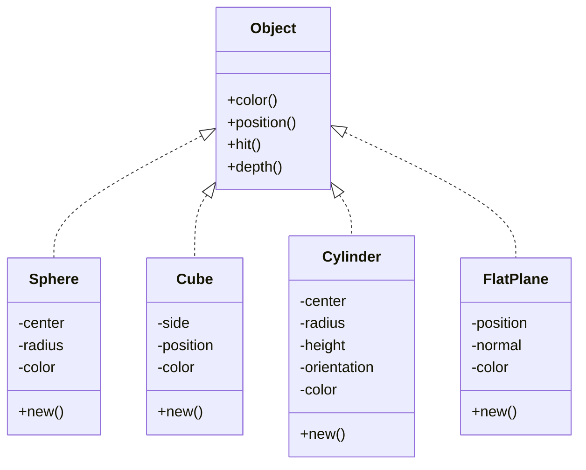

<h1 align=center>
    
    <br>
    rt
</h1>

## Table of Contents

- [Table of Contents](#table-of-contents)
- [Tech Stack](#tech-stack)
- [Overview](#overview)
- [Installation](#installation)
  - [Cloning](#cloning)
  - [File System](#file-system)
- [Usage](#usage)
  - [Classes](#classes)
- [Create objects](#create-objects)
  - [Sphere](#sphere)
  - [Cube](#cube)
  - [Cylinder](#cylinder)
  - [Flat plane](#flat-plane)
- [Mechanism](#mechanism)
  - [Camera](#camera)
  - [Ray](#ray)
- [Contributors](#contributors)
  - [Authors](#authors)
  - [Peers](#peers)
  - [Testers](#testers)
  - [Auditors](#auditors)
- [Sources](#sources)
- [License](#license)

## Tech Stack

[](./src/main.rs)
[](./scripts/gitify.sh)
[](#table-of-contents)


## Overview

This program is meant to render `3D` objects and places

<div align=center></div>

In the context of `3D` computer graphics, ray tracing is a technique for modeling light transport for use in a wide variety of rendering algorithms for generating digital images in `2D`.

## Installation

### Cloning

```shell
git clone http://learn.zone01dakar.sn/git/jefaye/rt
Cloning into 'rt'...
Username for 'https://learn.zone01dakar.sn': jefaye
Password for 'https://jefaye@learn.zone01dakar.sn':
warning: redirecting to https://learn.zone01dakar.sn/git/jefaye/rt/
remote: Enumerating objects: 86, done.
remote: Counting objects: 100% (86/86), done.
remote: Compressing objects: 100% (65/65), done.
remote: Total 86 (delta 12), reused 0 (delta 0), pack-reused 0
Receiving objects: 100% (86/86), 273.12 KiB | 8.28 MiB/s, done.
Resolving deltas: 100% (12/12), done.

cd rt
tree --dirsfirst
```

### File System

    📂./
      |
      +-📂 assets/
      |       |
      |       +-🌄 ferris.svg
      |       +-🌄 ray_trace_diagram.svg
      |       +-🌄 rays_viewport_schema.png
      |       +-🌄 raytrace.png
      |
      +-📂 scripts/
      |       |
      |       +-📜 gitify.sh
      |       +-📜 utils.sh
      |
      +---📂 src/
      |       |
      |       +-📂 geometry/
      |       |       |
      |       |       +-📂 objects/
      |       |       |       |
      |       |       |       +-📄 cube.rs
      |       |       |       +-📄 cylinder.rs
      |       |       |       +-📄 mod.rs
      |       |       |       +-📄 plane.rs
      |       |       |       +-📄 sphere.rs
      |       |       |
      |       |       +-📂 vectors/
      |       |       |       |
      |       |       |       +-📄 mod.rs
      |       |       |       +-📄 mutation.rs
      |       |       |       +-📄 scalar_ops.rs
      |       |       |       +-📄 vector_ops.rs
      |       |       |
      |       |       +-📄 mod.rs
      |       |
      |       +-📂 optics/
      |       |       |
      |       |       +-📄 camera.rs
      |       |       +-📄 light.rs
      |       |       +-📄 mod.rs
      |       |       +-📄 ray.rs
      |       |
      |       +-📂 graphics/
      |       |       |
      |       |       +-📄 image.rs
      |       |       +-📄 mod.rs
      |       |       +-📄 scene.rs
      |       |
      |       +-📄 lib.rs
      |       +-📄 main.rs
      |
      |
      +-📂 tests/
      |       |
      |       +-📄 vector_test.rs
      |
      +-📂 todos/
      |       |
      |       +-📝 audit.todo
      |       +-📝 tasks.todo
      |
      +-🚫 .gitignore
      +-🔒 Cargo.lock
      +-⚙️ Cargo.toml
      +-🔑 LICENSE
      +-📖 README.md
      +-⚙️ rustfmt.toml

## Usage

```shell
cargo run > assets/output.ppm
```

### Classes



## Create objects

### Sphere

First of all, the condition for a given point to be considered as being on the sphere is to have its **coordonates' absolute value** `equal` to the sphere's **radius**, better illustrated with the equation: $x^2 + y^2 + z^2 = R^2$. Given the center of the sphere the equation, that specific point's coordonates will be the difference between its **coordonates** and the sphere's **center** `C`:

$$
\\[25pt] \huge (x - C_x)^2 + (y - C_y)^2 + (z - C_z)^2 = r^2 \\[50pt]
$$

Considering these coordonates as part of a vector, those `x,y,z` operations can be shortcut to a **difference** between the given position `P` and de sphere's center `C`:
$$
\large (\vec{P}_{(x, y, z)} - \vec{C}_{(x, y, z)})\cdot(\vec{P}_{(x, y, z)} - \vec{C}_{(x, y, z)}) = (x - C_x)^2 + (y - C_y)^2 + (z - C_z)^2 = r^2 \\[15pt]
\Downarrow \\[15pt]
\huge (\vec{P} - \vec{C})\cdot(\vec{P} - \vec{C}) = r^2 \\[50pt]
$$

Now from the `ray casting` function, $P(t) = A + tb$, the point resulting from `t` should satify the contidion to be considered as hitting the sphere:

$$
\large (\vec{P}(t) - \vec{C}) \cdot (\vec{P}(t) - \vec{C}) = r^2 \\[15pt]
\Downarrow \\[15pt]
\large (\vec{A} + t\vec{b} - \vec{C}) \cdot (\vec{A} + t\vec{b} - \vec{C}) = r^2 \\[15pt]
\Downarrow \\[15pt]
\Large t^2\vec{b}^2 + 2t\vec{b} \cdot (\vec{A} - \vec{C}) + (\vec{A} - \vec{C}) \cdot (\vec{A} - \vec{C}) - r^2 = 0 \\[50pt]
$$

Finally, since $\large t$ is the only unknown, the `variable` so to say, and given that the equation is `quadratic`, $\large t$ can be solve using the quadratic formula:

$$
\\[25pt] \huge t = \frac{-b \pm \sqrt{b^2 - 4ac}}{2a} \\[-20pt]
$$
$\small Where:\\$
$\small a = \vec{b}^2\\$
$\small b = 2\vec{b} \cdot (\vec{A} - \vec{C})\\$
$\small c = (\vec{A} - \vec{C}) \cdot (\vec{A} - \vec{C}) - r^2\\[15pt]$
$$
b = 2h: \\[15pt]
\Downarrow \\[15pt]
\large t = \frac{-2h \pm \sqrt{(2h)^2 - 4ac}}{2a} \\[15pt]
\Downarrow \\[15pt]
\large t = \frac{-2h \pm 2\sqrt{h^2 - ac}}{2a} \\[15pt]
\Downarrow \\[25pt]
\Huge t = \frac{-h \pm \sqrt{h^2 - ac}}{a} \\[25pt]
$$

The `discriminant` ($h^2 - ac$), helps to identify how many intersection points exist between the ray and the sphere:

- `discriminant > 0`: There are two distinct intersection points. This means the ray enters and exits the sphere.

- `discriminant == 0`: There is exactly one intersection point (the ray is tangent to the sphere). This means the ray just touches the sphere at one point.

- `discriminant < 0`: There are no intersection points. This means the ray does not intersect the sphere at all.

### Cube

### Cylinder

### Flat plane

## Mechanism

### Camera

<figure align=center>
    
    <br>
    <figcaption>By <a href="//commons.wikimedia.org/w/index.php?title=User:Kamil_Kielczewski&amp;action=edit&amp;redlink=1" class="new" title="User:Kamil Kielczewski (page does not exist)">Kamil Kielczewski</a> - <span class="int-own-work" lang="en">Own work</span>, <a href="https://creativecommons.org/licenses/by-sa/4.0" title="Creative Commons Attribution-Share Alike 4.0">CC BY-SA 4.0</a>, <a href="https://commons.wikimedia.org/w/index.php?curid=76049175">Link</a></figcaption>
</figure>

### Ray

<figure align=center>
    
    <br>
    <figcaption>By <a href="//commons.wikimedia.org/wiki/User:Henrik" title="User:Henrik">Henrik</a> - <span class="int-own-work" lang="en">Own work</span>, <a href="https://creativecommons.org/licenses/by-sa/4.0" title="Creative Commons Attribution-Share Alike 4.0">CC BY-SA 4.0</a>, <a href="https://commons.wikimedia.org/w/index.php?curid=3869326">Link</a></figcaption>
</figure>

## Contributors

### Authors

[](http://learn.zone01dakar.sn/git/ndiediop)
[](http://learn.zone01dakar.sn/git/npouille)
[](http://learn.zone01dakar.sn/git/papebsow)
[](http://learn.zone01dakar.sn/git/jefaye)

### Peers

[](http://learn.zone01dakar.sn/git/jgoudiab)

### Testers

### Auditors

## Sources

[]()

[](https://en.wikipedia.org/wiki/Ray_tracing_(graphics))

## License

[](LICENSE)
